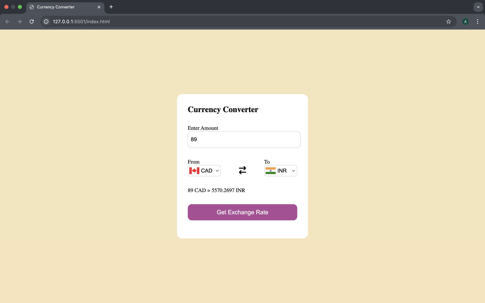
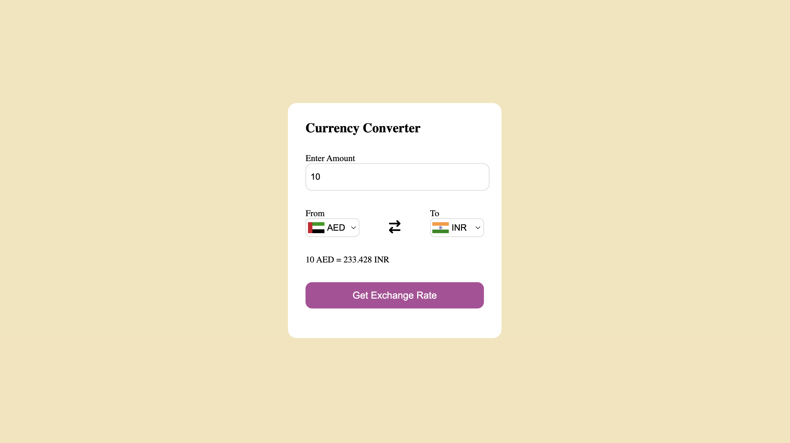

# 💱 Currency Converter Mini Project

This is a simple and interactive Currency Converter built with **HTML, CSS, and JavaScript**, using live exchange rates from the [ExchangeRate API](https://www.exchangerate-api.com/). It allows users to convert currencies between any two supported currencies and view country flags dynamically.

## 🌟 Features

- 🔄 Real-time currency conversion using ExchangeRate API
- 🌐 Supports all major currencies
- 🇺🇸 Country flags automatically update on currency selection
- 🧮 Default conversion from USD to INR
- 🎯 Simple and user-friendly UI
- 🚫 Handles empty or invalid input gracefully

## 📁 Project Structure
currency-converter/
├── index.html # Main HTML layout
├── style.css # Styling for the UI
├── script.js # JavaScript logic for API and UI handling
├── countryList.js # Currency-to-country mapping (for flags)
└── README.md # Project documentation

## 📷 Demo

## 🛠️ Technologies Used
HTML5 – Structure and layout
CSS3 – Styling and responsive design
JavaScript (Vanilla) – Functionality and interactivity
ExchangeRate API – Live currency data
FlagsAPI – Country flag images

## 📌 How It Works
On page load, dropdowns are filled with currency codes using countryList.js.
Selecting a currency updates the country flag using FlagsAPI.
When the convert button is clicked:
Fetches real-time exchange rates from ExchangeRate API.
Calculates the converted amount.
Displays the result in a readable format (e.g., 1 USD = 83.20 INR).

## 🔐 API Key Info
The project uses a free API key provided by ExchangeRate API. You can replace it in the BASE_URL inside script.js:
const BASE_URL = "https://v6.exchangerate-api.com/v6/YOUR_API_KEY/latest";
Sign up at https://www.exchangerate-api.com for your own key if needed.

## 🖼️ Screenshot

🤝 Contributing

Want to improve or extend this project? Fork the repo and submit a pull request with enhancements, bug fixes, or design updates!
